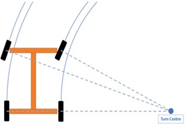
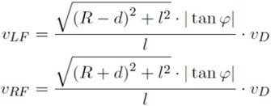
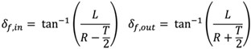
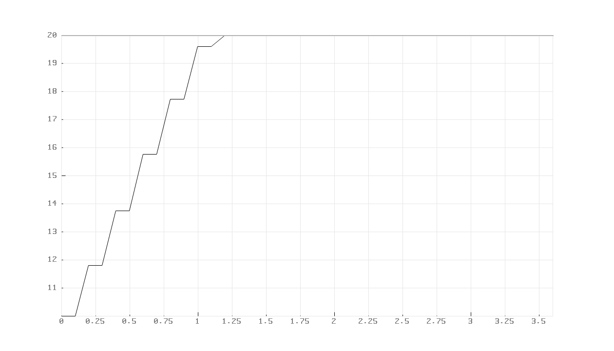
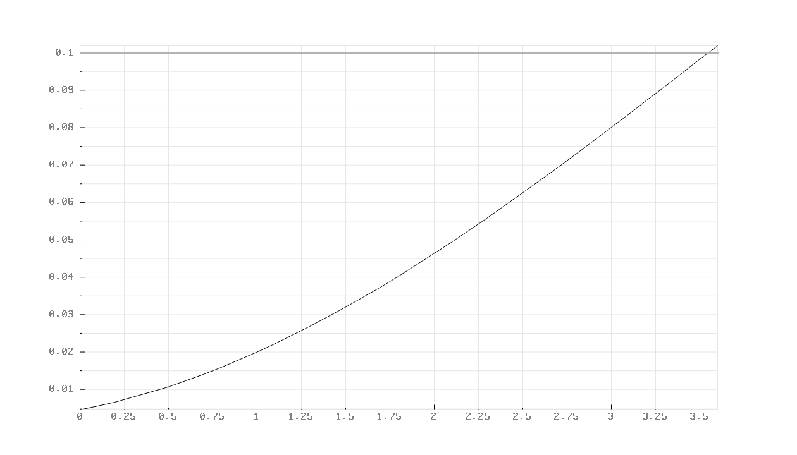

# Ackermann_Steering_Control
[](https://app.travis-ci.com/Prat33k-dev/Ackermann_Steering_Control)
[](https://coveralls.io/github/Prat33k-dev/Ackermann_Steering_Control?branch=dev)
[](https://opensource.org/licenses/MIT)
-----------------------

## Overview
Ackermann steering condition arises when axes of all wheels in a vehicle intersect
at a single turning point. In the case of Ackermann steering the wheels of the vehicle do not skid while turning as opposed to parallel steering. This reduces the tyre wear and increases the energy efficiency. Ackermann steering can be used in various autonomous systems such as self-driving cars, delivery robots which can increase the efficiency of the robot.

During the development the following assumptions
are made:
- All robot parameters are known.
- Initially the robot is on the origin of the world frame facing the x axis.
- Robot’s desired heading and velocity are given by the user as input.
- Maximum steering angle is 45 degrees.
- Friction and wheel slippage are considered negligible.
--------------------
## License
MIT License
```
Copyright (c) 2021 Pratik Bhujbal, Mohammed Maaruf Vazifdar, Maitreya Kulkarni.

Permission is hereby granted, free of charge, to any person obtaining a copy of this software and associated documentation files (the "Software"), to deal in the Software without restriction, including without limitation the rights to use, copy, modify, merge, publish, distribute, sublicense, and/or sell copies of the Software, and to permit persons to whom the Software is furnished to do so, subject to the following conditions:

The above copyright notice and this permission notice shall be included in all copies or substantial portions of the Software.

THE SOFTWARE IS PROVIDED "AS IS", WITHOUT WARRANTY OF ANY KIND, EXPRESS OR IMPLIED, INCLUDING BUT NOT LIMITED TO THE WARRANTIES OF MERCHANTABILITY, FITNESS FOR A PARTICULAR PURPOSE AND NONINFRINGEMENT. IN NO EVENT SHALL THE AUTHORS OR COPYRIGHT HOLDERS BE LIABLE FOR ANY CLAIM, DAMAGES OR OTHER LIABILITY, WHETHER IN AN ACTION OF CONTRACT, TORT OR OTHERWISE, ARISING FROM, OUT OF OR IN CONNECTION WITH THE SOFTWARE OR THE USE OR OTHER DEALINGS IN THE SOFTWARE.
```
------------------------------
## Project Technologies:
- Ubuntu 18.04
- Build System: cmake
- Version control: GitHub
- Software Tools: VS Code
- Build Check: Travis
- Code Coverage: Coveralls
---------------------------------
## External Library: 
- [pbPlots](https://github.com/InductiveComputerScience/pbPlots) (Covered under MIT License) :  A plotting library used to show convergence to desired goals on graphs.
---------------------------------
## Deliverables
- Project: A robust Ackermann Steering Control, outputs are wheel angles and velocities.
- Graphical Representation of convergence of heading and speed to set points.
- Overview of proposed work that includes timelines risks and mitigations.
- UML Diagrams.
- Additon of Coveralls and travis for code coverage
-------------------------------
## Working
As the vehicle travels along a curved path, all four tyres follow unique trajectories around a shared turn centre, as defined by the blue arcs shown below.
----------------------------------
<p align="left">
  
</p> 

For a given turn radius R, wheelbase L, and track width T, the required front steering angles (δ_(f,in) and δ_(f,out)) with the following expressions .And Similarly, we can calculate the wheel speeds using the following equations, where desired drive speed is denoted by 𝑽𝑫 while 𝑽𝑹𝑭, 𝑽𝑳𝑭 are front right and left wheel speed., 𝒍 denotes the length of vehicle, 𝒅 denotes the distance between wheel and kinematic centre and 𝝋 is steer angle.
<p align="left">


</p>

-------------------
## Risk and Mitigations
- Robot can't go in backward direction. For this case can implement more cases instead of just go around by making a full turn in forward direction
- The desired heading & speed sometimes overshoots and maintain steady state error. For this can be resolved by tuning PID gains. 
-  User can't give input heading in negative instead have to give positive value from 0-3.14 (in radians).
-------------------
## Results
For a specific set of inputs, the desired speed and the desired heading angle is acheived within expected range of +-5%. Example shown below with convergence for input as 0.1 and 5 for desired heading and speed and output with each forward wheel velocities and angles.

Outout on graphs for same inputs showing convergence for speed and heading:
<p align="left">
  
  
</p> 

-------------------------------